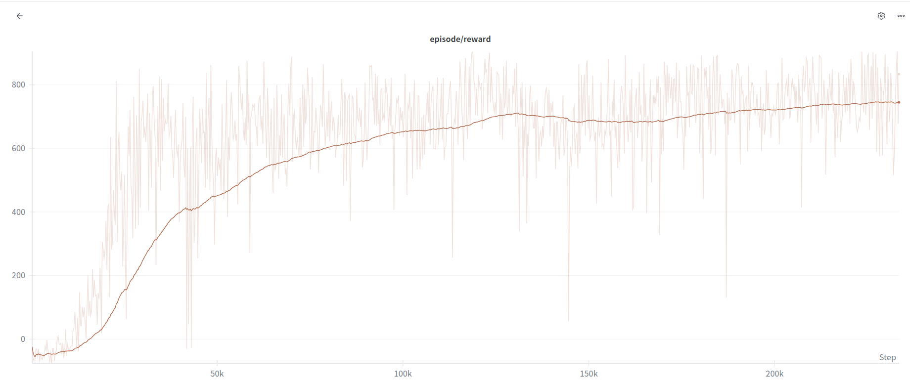

# Car Racing DQN Agent

<div align="center">


[](https://opensource.org/licenses/MIT)
[](https://img.shields.io/badge/version-0.0.1-blue)

</div>

<details> 
<summary><b>📋 Table of contents </b></summary>

- [Car Racing DQN Agent](#car-racing-dqn-agent)
  - [Description](#description)
  - [Features](#features)
  - [Results](#results)
  - [Prerequisites](#prerequisites)
  - [Getting started](#getting-started)
  - [Usage](#usage)
    - [📖 Generate Documentation Site](#-generate-documentation-site)
  - [Testing](#testing)
    - [License](#license)

</details>

## Description

This project implements a Deep Q-Network (DQN) agent to play the [CarRacing-v3](https://gymnasium.farama.org/environments/box2d/car_racing/) environment from OpenAI Gym. The agent is trained using reinforcement learning techniques to navigate the racetrack efficiently and managing to achieve max score for the environment, something I can not do myself.

## Features

- **DQN Implementation** — A fully functional Deep Q-Learning agent with:

  - Experience replay (`TensorDictReplayBuffer`)
  - Soft target updates
  - Epsilon-greedy exploration
  - Double DQN target computation
  - Gradient clipping and AdamW optimization
  - Integrated **Weights & Biases (W&B)** logging for metrics and model artifacts

- **Environment Wrappers** — Preprocessing for Gymnasium environments including:

  - Frame skipping, grayscale conversion, resizing, and frame stacking
  - Automatic video recording and episode statistics tracking

- **Configurable Training** — YAML-based configuration system using Pydantic for environment, training, and logging settings.

- **Human Play** — Play the CarRacing-v3 environment using keyboard controls.

## Results

Here are some videos showing the performance of the trained DQN agent in several environments:
[](https://youtu.be/LQX-K7W1mms)
[](https://youtu.be/g4XEODjK5Zg)
[](https://youtu.be/lTiU9PotseQ)

Here is a plot showing the training performance of the DQN agent over time:


## Prerequisites

- **Git**: Ensure that git is installed on your machine. [Download Git](https://git-scm.com/downloads)
- **Python 3.12**: Required for the project. [Download Python](https://www.python.org/downloads/)
- **UV**: Used for managing Python environments. [Install UV](https://docs.astral.sh/uv/getting-started/installation/)
- **WandB**: For experiment tracking and visualization. [Create an account](https://wandb.ai/site)
- **CUDA**: If you plan to use GPU acceleration, ensure that CUDA is installed. [Install CUDA](https://developer.nvidia.com/cuda-downloads)

## Getting started

1. **Clone the repository**:

   ```sh
   git clone https://github.com/CogitoNTNU/car-racing-dqn-agent.git
   cd car-racing-dqn-agent
   ```

1. **Install dependencies**:

   ```sh
   uv sync
   ```

1. **Configure environment variables**:
   This project uses environment variables for configuration. Copy the example environment file to create your own:

   ```sh
   cp .env.example .env
   ```

   Then edit the `.env` file to include your specific configuration settings.

1. **Set up pre commit** (only for development):

   ```sh
   uv run pre-commit install
   ```

## Usage

To run the project, run the following command from the root directory of the project:

To train a DQN agent using the default configuration, use:

```bash
uv run main.py train
```

To train a DQN agent with a specific configuration file in `configs`, use:

```bash
uv run main.py train --config <name_of_config_file.yaml>
```

Then one can change the environment and agent parameters in the config file.

To run a saved DQN agent, use:

```bash
uv run main.py run --agent-name <path_to_model_parameters>
```

To play the game using the keyboard, use:

```bash
uv run main.py play
```

### 📖 Generate Documentation Site

To build and preview the documentation site locally:

```bash
uv run mkdocs build
uv run mkdocs serve
```

This will build the documentation and start a local server at [http://127.0.0.1:8000/](http://127.0.0.1:8000/) where you can browse the docs and API reference. Get the documentation according to the lastes commit on main by viewing the `gh-pages` branch on GitHub: [https://cogitontnu.github.io/car-racing-dqn-agent/](https://cogitontnu.github.io/car-racing-dqn-agent/).

## Testing

To run the test suite, run the following command from the root directory of the project:

```bash
uv run pytest --doctest-modules --cov=src --cov-report=html
```

### License

______________________________________________________________________

Distributed under the MIT License. See `LICENSE` for more information.
